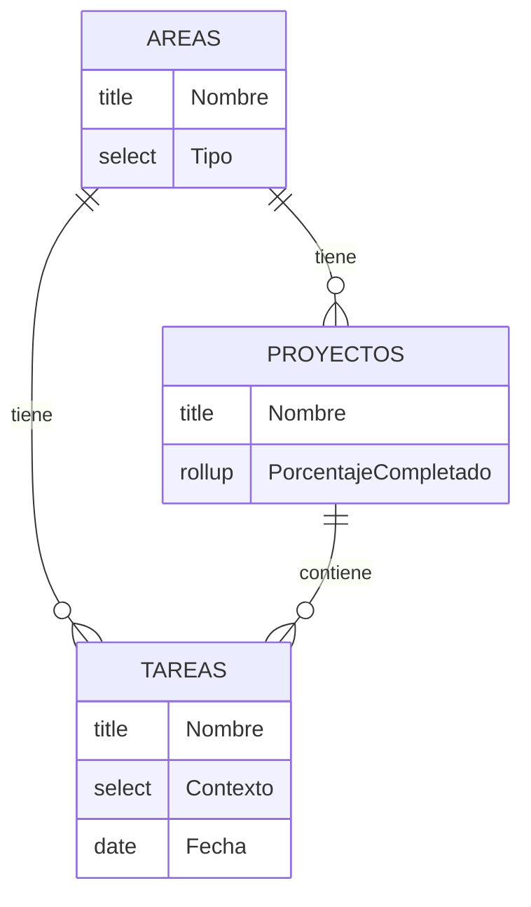

>[!example] EJEMPLO ficticio
>Este doc es la **demostración** de las 7 secciones que exige el [SOP Conectores](<../../00 Sistema/SOP Conectores.md>) §3, con un workspace de Notion inventado. Cuando conectes un sistema real, **reemplazá el contenido** (o creá `{Tu Sistema} - Arquitectura.md` al lado y borrá este). Los IDs `collection://…` son de fantasía.

# Notion — Arquitectura del Workspace

Documentación técnica de un workspace de Notion de ejemplo.
Cubre el modelo de datos, relaciones entre bases y registro de cambios.

---

## ERD — Modelo de relaciones



**Recursos** no tiene relaciones formales con las otras bases: se conecta a las páginas de Área mediante vistas enlazadas filtradas por texto (sin campo relation). Documentarlo evita que un agente busque una relation que no existe.

---

## Diccionario de bases de datos

### Áreas
`collection://00000000-0000-0000-0000-000000000001`

Centro organizador del workspace. Todo se relaciona a partir de aquí.

| Campo | Tipo | Descripción |
|---|---|---|
| Nombre | Title | Nombre del área |
| Tipo | Select | Trabajo · Estudio · Personal |
| Proyectos | Relation (synced) | ↔ Proyectos |
| Tareas | Relation (synced) | ↔ Tareas |

### Proyectos
`collection://00000000-0000-0000-0000-000000000002`

Gestión de iniciativas con inicio y fin.

| Campo | Tipo | Descripción |
|---|---|---|
| Nombre | Title | Nombre del proyecto |
| Áreas | Relation | → Áreas |
| Tareas | Relation | → Tareas |
| % Completado | Rollup | Porcentaje de tareas completadas |

### Tareas
`collection://00000000-0000-0000-0000-000000000003`

Centro operativo del workspace. Implementa flujo GTD.

| Campo | Tipo | Descripción |
|---|---|---|
| Nombre | Title | Descripción de la tarea |
| Proyecto | Relation | → Proyectos |
| Áreas | Relation | → Áreas |
| Contexto | Select | estudiar · trabajo |
| Tipo de Tarea | Select | bandeja de entrada · Accionable · Algún Día · Papelera |
| Fecha | Date | Fecha límite o de ejecución |

### Recursos
`collection://00000000-0000-0000-0000-000000000004`

Repositorio de herramientas, referencias y materiales.

| Campo | Tipo | Descripción |
|---|---|---|
| Nombre | Title | Nombre del recurso |
| Tipo | Multi-select | Categorización — pendiente de normalizar |
| URL | URL | Enlace al recurso |
| Archivado | Checkbox | Indica si el recurso está inactivo |

---

## Mapa de dependencias

```
Áreas
  ├── Proyectos ──→ Tareas
  │       └── [huérfana: Untitled DB — ejemplo de trampa a documentar]
  └── Tareas

Recursos (standalone)
  └── [sin relaciones formales — conectado por vistas enlazadas]
```

---

## Convenciones

| Convención | Regla |
|---|---|
| Nombres de bases | PascalCase singular: `Áreas`, `Proyectos`, `Tareas` |
| Opciones de Select | Sentence case: `Algún Día`, `Trabajo` |
| Relaciones duales | Solo cuando la base destino necesita ver el backlink |
| Campos automáticos | `Fecha de creación` · `Última edición` en todas las bases |

---

## Deuda técnica pendiente

| Prioridad | Item | Base afectada |
|---|---|---|
| Alta | Limpiar relación huérfana a Untitled DB (retorna 404) | Proyectos |
| Media | Normalizar campo `Tipo` (mezcla plataformas con categorías) | Recursos |

> Esta sección es la más valiosa para un agente: documenta las trampas que el schema en vivo no explica ([SOP Conectores](<../../00 Sistema/SOP Conectores.md>) §4).

---

## Changelog

| Fecha | Cambio | Motivo |
|---|---|---|
| 2026-07-14 | Convertido en ejemplo ficticio para el template | El original documentaba un workspace real |
| 2026-06-26 | Creado siguiendo [SOP Conectores](<../../00 Sistema/SOP Conectores.md>) | Primer conector documentado |
